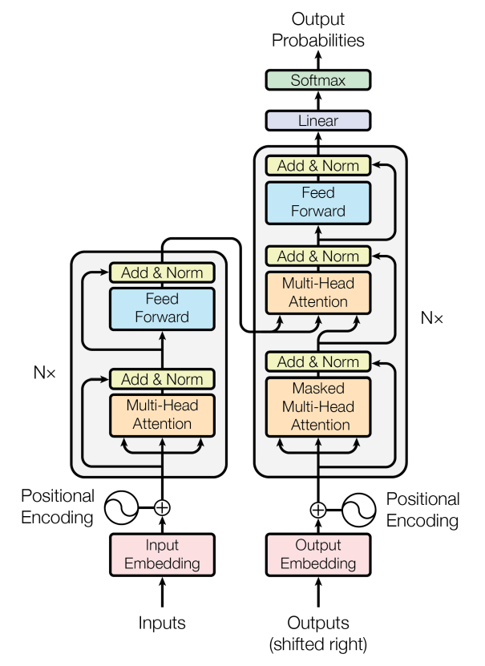

# Transform

$$
\text{Attention}(Q, K, V) = \text{softmax}\left(\frac{QK^T}{\sqrt{d_k}}\right)V
$$

K = [[1, 2, 0], [1, 2, 0], [0, 0, 2], [1, 4, 0]] 

V = [[18], [20], [22], [19]]

Q = [1, 0, 0]

\sqrt{d_k} 是query和key向量的长度.由于query和key要做点乘，这两种向量的长度必须一致。value向量的长度倒是可以不一致，论文里把value向量的长度叫做

### 自注意力
自注意力模块的目的是为每一个输入token生成一个向量表示，该表示不仅能反映token本身的性质，还能反映token在句子里特有的性质。